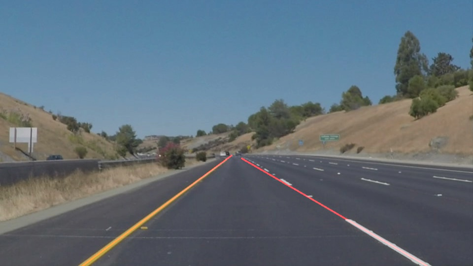

# **Finding Lane Lines on the Road** 

The goals / steps of this project are the following:
* Make a pipeline that finds lane lines on the road
* Reflect on your work in a written report

---

### 1. Describe your pipeline. As part of the description, explain how you modified the draw_lines() function.

My pipeline consisted of 5 steps. First, I converted the images to grayscale, then I applied a Gaussian smoothing with kernel size of 7 pixels followed by the Canny edge detector. Then we set the road boundaries with a polygon mask to filter out misleading edges in the image. Next, I applied Hough transform to get the final lines which are finally painted over the initial image.

In order to draw a single line on the left and right lanes, I modified the draw_lines() function by fitting a single line from the edges having the same slope sign taking into account that lines are given in the form of points. Positve slope corresponds to the left line and negative slope to the right line. We impose contraints on the value of the slope to get rid of vertical and horizontal lines.

A linear fit gives the intercept and the slope. These coefficients are used to draw the lane lines. By providing the initial point of the line you can get the projected end point.

### 2. Identify potential shortcomings with your current pipeline

One potential shortcoming would be what would happen when the camera in the camera records curved lanes. Actually, it is seen in the challenge problem.

Another shortcoming could be any other complex lane configuration, such as crossroads, roundabouts, and so on.

### 3. Suggest possible improvements to your pipeline

A possible improvement for the curved lane problem would be to reduce the height of the polygon mask to just detect the straight portion of the lane, or maybe to apply quadratic or stepwise regression. This has not been tested yet.

### 4. Results

One of the resulting images after using my designed pipeline. Some detected lines are not clearly visible when they are superimposed onto the white and yellow lines.

Lines in images and video are drawn with the updated version of the *draw_lines(...)* function:

* Output images are located in "test_images_output" directory
* Output videos are located in "test_videos_output" directory
